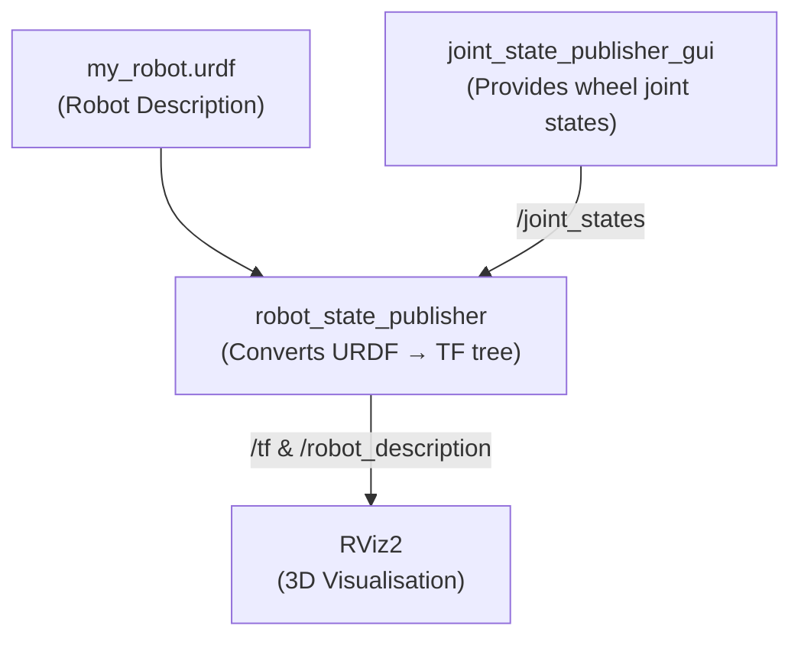

# Practical 1 — Create a Mobile Robot Base URDF Model 🚗

## Objective
Build a 3D model of a 4-wheeled mobile robot base with a LiDAR sensor using pure URDF (Unified Robot Description Format) and visualise it in RViz2.

---

## 📦 Software Required

| Software | Purpose | Install |
|----------|---------|---------|
| Ubuntu 22.04 | OS | Download from ubuntu.com |
| ROS 2 Humble | Robot middleware | `sudo apt install ros-humble-desktop` |
| RViz2 | 3D visualiser | Included in `ros-humble-desktop` |
| `urdf_tutorial` | Quick URDF launcher | `sudo apt install ros-humble-urdf-tutorial` |
| VS Code | File editor | `sudo snap install code --classic` |

---

## 📁 Files in This Folder

```
Practical_1_Mobile_Robot_URDF/
└── my_robot.urdf     ← THE single file that defines the entire robot
```

### `my_robot.urdf` — What it Does
This is a **plain URDF XML file**. It describes every physical part of the robot as **links** (rigid bodies) and **joints** (connections between them).

| Section | What it defines |
|---------|-----------------|
| `<material>` blocks | Colours used by links (white, black, orange, red) |
| `<link name="base_link">` | The main rectangular chassis |
| `<link name="lidar">` | The cylindrical LiDAR sensor on top |
| `<link name="*_wheel">` × 4 | Four wheels (front-left, front-right, back-left, back-right) |
| `<joint name="base_lidar_joint">` | Fixes the LiDAR rigidly on top of chassis |
| `<joint name="base_*_wheel_joint">` × 4 | Connects each wheel as a `continuous` (spinning) joint |

---

## 🎨 Customisable Parameters — Change These to Get a Different Robot!

All the interesting numbers live in `my_robot.urdf`. Open it in VS Code and tweak:

### 1. Chassis Size
```xml
<!-- Line 25: Change to make the robot wider/longer/taller -->
<box size="0.65 0.45 0.2"/>
<!--           ↑     ↑    ↑
              Length Width Height  (all in metres)
    Try:  0.40 0.30 0.15  → compact robot
          1.00 0.60 0.25  → large platform  -->
```

### 2. Chassis Colour
```xml
<!-- Line 27 -->
<material name="orange"/>
<!-- Change to: "white", "black", "red" — defined at the top of the file
     Or add your own custom colour:
     <material name="blue">
         <color rgba="0 0 1 1"/>
     </material>  -->
```

### 3. Wheel Size
```xml
<!-- Lines 44, 54, 64, 74 (one per wheel) -->
<cylinder radius="0.08" length="0.04"/>
<!--                ↑            ↑
                  radius       width
    Try: radius="0.12" → big off-road wheels
         radius="0.05" → small indoor wheels  -->
```

### 4. Wheel Positions (Wheelbase / Track Width)
```xml
<!-- Line 91 (back-left wheel joint origin) -->
<origin xyz="-0.2 0.245 0" rpy="0 0 0"/>
<!--           ↑     ↑
          X position  Y position  (half the track width)
    Increase 0.245 → wider stance
    Change  -0.2  → move wheels forward/backward  -->
```

### 5. LiDAR Size & Position
```xml
<!-- LiDAR geometry (line 34) -->
<cylinder radius="0.08" length="0.06"/>

<!-- LiDAR position (line 85) — how high above chassis -->
<origin xyz="0 0 0.23" rpy="0 0 0"/>
<!--              ↑  change this Z value to raise/lower the sensor  -->
```

---

## 🏃 How to Run

### Step 1 — Install `urdf_tutorial`
```bash
sudo apt install ros-humble-urdf-tutorial
```

### Step 2 — Launch
```bash
# Source ROS (if not in ~/.bashrc)
source /opt/ros/humble/setup.bash

# Launch — replace the path if you saved the file elsewhere
ros2 launch urdf_tutorial display.launch.py \
    model:=/home/kshitij/Basics-of-ROS-and-SLAM/Practical_1_Mobile_Robot_URDF/my_robot.urdf
```

### Step 3 — Visualise
RViz2 opens automatically. You will see the orange chassis, four black wheels, and a red LiDAR cylinder. Use the **Joint State Publisher GUI** sliders to spin the wheels.

---

## 🗺️ Architecture Diagram



---

## ✅ Expected Output
- A 3D orange box (chassis) with 4 black cylindrical wheels and a red LiDAR disc on top.
- Sliders in the Joint State Publisher GUI rotate the wheels in real-time.
