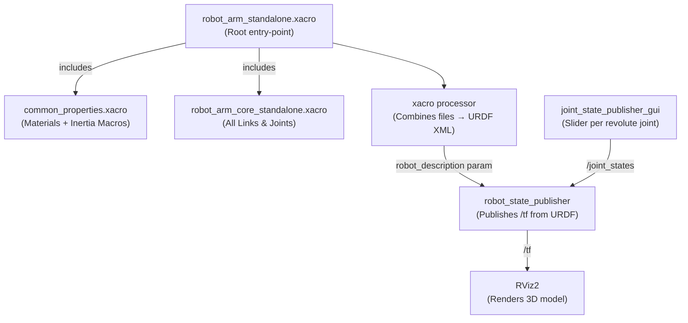

# Practical 2 — Create a 3-DOF Robot Arm URDF Model 🦾

## Objective
Design a 3-Degree-of-Freedom (3-DOF) robotic arm using **Xacro** (XML Macros for URDF), visualise it in RViz2, and interactively move its joints using the Joint State Publisher GUI.

---

## 📦 Software Required

| Software | Purpose | Install |
|----------|---------|---------|
| ROS 2 Humble | Robot middleware | `sudo apt install ros-humble-desktop` |
| Xacro | URDF macro processor | `sudo apt install ros-humble-xacro` |
| `joint_state_publisher_gui` | Interactive joint sliders | `sudo apt install ros-humble-joint-state-publisher-gui` |
| RViz2 | 3D visualiser | Included in `ros-humble-desktop` |

---

## 📁 Files in This Folder

```
Practical_2_Robot_Arm_URDF/
├── urdf/
│   ├── common_properties.xacro          ← Shared colours + inertia math macros
│   ├── robot_arm_core_standalone.xacro  ← Arm geometry (all links + joints)
│   └── robot_arm_standalone.xacro       ← Root file that includes the others
└── launch/
    └── display.launch.py                ← Launches RViz + joint sliders
```

### Why Three Xacro Files?
Xacro splits the description into logical modules so each file has a single responsibility:

| File | Responsibility |
|------|---------------|
| `common_properties.xacro` | Defines colours (materials) and inertia formula macros so they are not repeated everywhere |
| `robot_arm_core_standalone.xacro` | Contains every `<link>` and `<joint>` for the arm. **This is where you tune geometry.** |
| `robot_arm_standalone.xacro` | The root entry-point; uses `<xacro:include>` to stitch the two files above together |

### `display.launch.py` — What it Does
| Node launched | Purpose |
|---------------|---------|
| `robot_state_publisher` | Reads the processed URDF and publishes transforms (`/tf`) |
| `joint_state_publisher_gui` | Provides a GUI with sliders for each revolute joint |
| `rviz2` | Opens the 3D visualiser with a pre-configured view |

---

## 🤖 Robot Structure

```
world (fixed frame)
  └── arm_base_link  [black box pedestal]
        └── joint_1 (revolute — YAW, rotates full 360°)
              └── link_1  [purple cylinder — shoulder]
                    └── joint_2 (revolute — PITCH, ±90°)
                          └── link_2  [orange cylinder — forearm]
                                └── joint_3 (revolute — PITCH, ±90°)
                                      └── link_3  [red cylinder — wrist]
                                            └── end_effector_link  [yellow sphere]
```

---

## 🎨 Customisable Parameters

### 1. Link Lengths — Make the Arm Taller or Shorter

Open `urdf/robot_arm_core_standalone.xacro`:

```xml
<!-- LINK 1 — Shoulder (search "link_1") -->
<cylinder radius="0.0375" length="0.3"/>
<!--                              ↑ change to 0.4 for a longer upper arm -->

<!-- LINK 2 — Forearm (search "link_2") -->
<cylinder radius="0.03" length="0.225"/>
<!--                           ↑ change to 0.3 for longer reach -->

<!-- LINK 3 — Wrist (search "link_3") -->
<cylinder radius="0.0225" length="0.15"/>
<!--                             ↑ change to 0.2 for longer wrist -->
```

### 2. Link Radii — Make the Arm Thicker or Thinner
```xml
<!-- Link 1 radius — default 0.0375 m  -->
<cylinder radius="0.0375" length="0.3"/>
<!--               ↑ increase to 0.06 for a bulky arm, decrease to 0.02 for slim -->
```

### 3. Joint Motion Limits — Restrict or Expand Range of Motion
```xml
<!-- joint_1 — currently full rotation -->
<limit lower="-3.14159" upper="3.14159" effort="100.0" velocity="1.0"/>
<!-- Change to lower="-1.5708" upper="1.5708" to restrict to ±90° -->

<!-- joint_2 and joint_3 — currently ±90° -->
<limit lower="-1.5708" upper="1.5708" effort="100.0" velocity="1.0"/>
<!-- Change to lower="-0.7854" upper="0.7854" to restrict to ±45° -->
```

### 4. Link Colours
```xml
<material name="purple"/>   <!-- link_1: try "blue", "green", "grey" -->
<material name="orange"/>   <!-- link_2 -->
<material name="red"/>      <!-- link_3 -->
<material name="yellow"/>   <!-- end_effector -->
```
All available colours are defined in `common_properties.xacro`:
`grey`, `orange`, `black`, `blue`, `red`, `green`, `yellow`, `purple`

### 5. Arm Base Pedestal Size
```xml
<!-- arm_base_link in robot_arm_core_standalone.xacro -->
<box size="0.2 0.2 0.1"/>
<!--       W   D   H   — change 0.2 0.2 to 0.3 0.3 for a wider base -->
```

### 6. End-Effector (Gripper Tip) Size
```xml
<sphere radius="0.03"/>
<!-- increase to 0.05 for a larger gripper, decrease to 0.015 for a precise tip -->
```

---

## 🏃 How to Run

### Prerequisites — Build as a ROS Package
This practical must live inside a ROS 2 workspace to use the launch file.

```bash
# 1. Create workspace (skip if you already have one)
mkdir -p ~/ros2_ws/src
cd ~/ros2_ws/src

# 2. Copy the Practical_2 folder here and name it robot_arm_description
cp -r ~/Basics-of-ROS-and-SLAM/Practical_2_Robot_Arm_URDF ./robot_arm_description

# 3. Build
cd ~/ros2_ws
source /opt/ros/humble/setup.bash
colcon build --packages-select robot_arm_description
source install/setup.bash

# 4. Launch
ros2 launch robot_arm_description display.launch.py
```

> **Note:** The launch file (`display.launch.py`) looks for a package named `robot_arm_description`. The folder must be named exactly that inside your workspace `src/`.

---

## 🗺️ Data Flow Diagram



---

## ✅ Expected Output
- A 3D robotic arm standing upright.
- Three GUI sliders labelled `joint_1`, `joint_2`, `joint_3` — drag them to rotate each segment of the arm in RViz.
