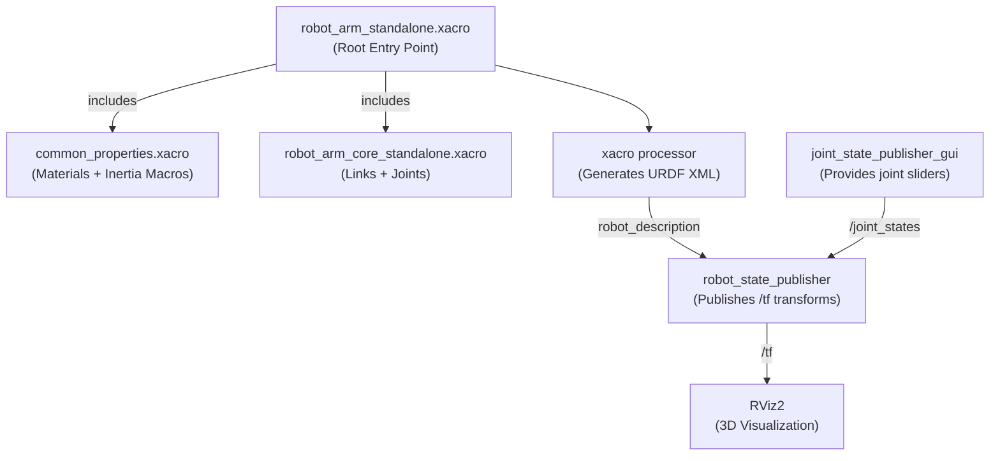

# Practical 2 — Create a 3-DOF Robot Arm URDF Model 🦾

## Objective
Design a 3-Degree-of-Freedom (3-DOF) robotic arm using **Xacro** (XML Macros for URDF), visualize it in RViz2, and interactively control its joints using the `joint_state_publisher_gui` sliders.

---

## 📦 Software Required

| Software | Purpose | Installation |
|----------|---------|--------------|
| ROS 2 Humble | Robot middleware | `sudo apt install ros-humble-desktop` |
| Xacro | URDF macro processor | `sudo apt install ros-humble-xacro` |
| `joint_state_publisher_gui` | Interactive joint sliders | `sudo apt install ros-humble-joint-state-publisher-gui` |
| RViz2 | 3D visualizer | Included in `ros-humble-desktop` |

---

## 📁 Files in This Folder

```
Practical_2_Robot_Arm_URDF/
├── package.xml                          ← ROS 2 package declaration format 3
├── CMakeLists.txt                       ← Ament CMake build configuration
├── urdf/
│   ├── common_properties.xacro          ← Shared colors + inertia math macros
│   ├── robot_arm_core_standalone.xacro  ← Arm geometry (links + joints with world root)
│   ├── robot_arm_core.xacro             ← Arm geometry without world root (for base integration)
│   ├── robot_arm_standalone.xacro       ← Standalone root file
│   └── robot_arm.urdf.xacro             ← Main Xacro entry point
├── launch/
│   └── display.launch.py                ← Portable launch file (RViz2 + Joint Sliders)
└── rviz/
    └── display.rviz                     ← Pre-configured RViz visualizer layout
```

### Module Responsibilities

| File | Responsibility |
|------|---------------|
| `package.xml` | Declares ROS 2 package dependencies (`xacro`, `urdf`, `rviz2`, `robot_state_publisher`) |
| `CMakeLists.txt` | Configures package installation for colcon build |
| `common_properties.xacro` | Defines materials/colors and inertia formula macros |
| `robot_arm_core_standalone.xacro` | Contains link/joint geometry attached to fixed `world` link |
| `robot_arm_standalone.xacro` | Main standalone entry point including `common_properties` & `robot_arm_core_standalone` |
| `display.launch.py` | Automatically discovers package files and launches RSP, JSP GUI, and RViz2 |

---

## 🤖 Robot Kinematic Tree

```
world (fixed frame)
  └── arm_base_link  [black pedestal box]
        └── joint_1 (revolute — YAW: rotates full 360°)
              └── link_1  [purple cylinder — shoulder]
                    └── joint_2 (revolute — PITCH: ±90°)
                          └── link_2  [orange cylinder — forearm]
                                └── joint_3 (revolute — PITCH: ±90°)
                                      └── link_3  [red cylinder — wrist]
                                            └── end_effector_link  [yellow sphere gripper]
```

---

## 🎨 Customisable Parameters

### 1. Link Lengths — Change Arm Heights & Reach
Edit `urdf/robot_arm_core_standalone.xacro`:
```xml
<!-- LINK 1 — Shoulder (search "link_1") -->
<cylinder radius="0.0375" length="0.3"/>     <!-- change length="0.4" for taller shoulder -->

<!-- LINK 2 — Forearm (search "link_2") -->
<cylinder radius="0.03" length="0.225"/>     <!-- change length="0.3" for longer reach -->

<!-- LINK 3 — Wrist (search "link_3") -->
<cylinder radius="0.0225" length="0.15"/>    <!-- change length="0.2" for longer wrist -->
```

### 2. Link Radii — Make Arm Thicker / Thinner
```xml
<cylinder radius="0.0375" length="0.3"/>     <!-- increase to 0.06 for heavy arm, 0.02 for slim -->
```

### 3. Joint Rotation Limits
```xml
<!-- joint_1 — yaw rotation range -->
<limit lower="-3.14159" upper="3.14159" effort="100.0" velocity="1.0"/>

<!-- joint_2 & joint_3 — pitch limits (default ±90°) -->
<limit lower="-1.5708" upper="1.5708" effort="100.0" velocity="1.0"/>
```

### 4. Materials & Colors
Available in `common_properties.xacro`: `purple`, `orange`, `red`, `yellow`, `blue`, `green`, `black`, `grey`.

---

## 🏃 How to Run

### Method 1: Direct Launch (No build required!)
You can launch directly from this folder without building:
```bash
cd ~/Basics-of-ROS-and--SLAM/Practical_2_Robot_Arm_URDF
source /opt/ros/humble/setup.bash
ros2 launch launch/display.launch.py
```

### Method 2: Building in a ROS 2 Workspace (Recommended)
```bash
# 1. Copy package into your ROS 2 workspace src directory
cd ~/ros2_ws/src
cp -r ~/Basics-of-ROS-and--SLAM/Practical_2_Robot_Arm_URDF ./practical_2_robot_arm_urdf

# 2. Build with colcon
cd ~/ros2_ws
source /opt/ros/humble/setup.bash
colcon build --packages-select practical_2_robot_arm_urdf

# 3. Source workspace overlay and launch
source install/setup.bash
ros2 launch practical_2_robot_arm_urdf display.launch.py
```

---

## 🗺️ Data Flow Diagram



---

## ✅ Expected Output
- RViz2 launches displaying a 3-DOF robot arm anchored to `world`.
- A GUI popup window appears with three sliders (`joint_1`, `joint_2`, `joint_3`).
- Moving any slider rotates the corresponding link in real-time in RViz2.
