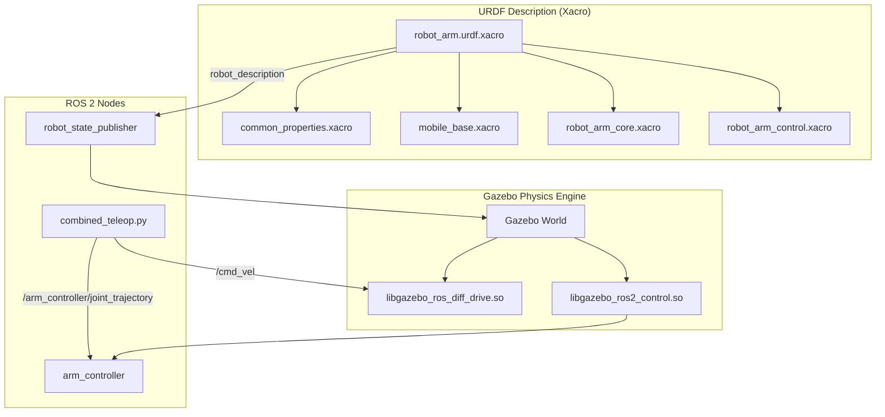

# Practical 3 — Attach Robot Arm to Base & Simulate in Gazebo 🤖🦾

## Objective
Combine the mobile robot base (Practical 1) and the 3-DOF arm (Practical 2) into a single **mobile manipulator**, simulate it in the **Gazebo physics simulator**, and control both the mobile base and the arm via keyboard teleoperation.

---

## 📦 Software Required

| Software | Purpose | Installation |
|----------|---------|--------------|
| ROS 2 Humble | Robot middleware | `sudo apt install ros-humble-desktop` |
| Gazebo (Classic) | Physics simulation engine | `sudo apt install ros-humble-gazebo-ros-pkgs` |
| `gazebo_ros2_control` | Bridge Gazebo ↔ `ros2_control` | `sudo apt install ros-humble-gazebo-ros2-control` |
| `ros2_control` + `ros2_controllers` | Joint trajectory control | `sudo apt install ros-humble-ros2-control ros-humble-ros2-controllers` |

---

## 📁 Files in This Folder

```
Practical_3_Gazebo_Simulation/
├── package.xml                          ← ROS 2 package declaration format 3
├── CMakeLists.txt                       ← Ament CMake build configuration
├── urdf/
│   ├── robot_arm.urdf.xacro             ← Root Xacro file (includes all modules)
│   ├── common_properties.xacro          ← Shared colors + inertia math macros
│   ├── mobile_base.xacro                ← 4-wheel chassis + Gazebo diff-drive plugin
│   ├── robot_arm_core.xacro             ← 3-DOF arm geometry attached to base_link
│   └── robot_arm_control.xacro          ← ros2_control hardware interfaces & plugin
├── launch/
│   └── gazebo.launch.py                 ← Portable launch file (Gazebo + Spawners)
├── config/
│   └── ros2_controllers.yaml            ← JointTrajectoryController configuration
└── scripts/
    ├── launch_sim.sh                    ← ★ One-click launcher (runs Gazebo + Teleops)
    ├── kill_sim.sh                      ← Clean simulation shutdown script
    ├── combined_teleop.py               ← Single-terminal keyboard driver (Base + Arm)
    ├── base_teleop.py                   ← Base driving script
    └── arm_teleop.py                    ← Arm joint control script
```

---

## 🤖 Robot Structure & Arm Mounting

```
base_footprint (ground frame)
  └── base_link  [orange chassis box]
        ├── front_left_wheel, front_right_wheel, back_left_wheel, back_right_wheel
        ├── lidar  [red cylinder, forward mounted]
        └── arm_base_link  [black box pedestal mounted at xyz="-0.1 0 0.2"]
              └── joint_1 (revolute — YAW)
                    └── link_1  [purple cylinder]
                          └── joint_2 (revolute — PITCH)
                                └── link_2  [orange cylinder]
                                      └── joint_3 (revolute — PITCH)
                                            └── link_3  [red cylinder]
                                                  └── end_effector_link  [yellow sphere]
```

---

## 🎨 Customisable Parameters

### 1. Arm Mounting Position (`urdf/robot_arm_core.xacro`)
```xml
<joint name="arm_base_joint" type="fixed">
    <parent link="base_link"/>
    <child link="arm_base_link"/>
    <origin xyz="-0.1 0 0.2" rpy="0 0 0"/>  <!-- change xyz="-0.1 0 0.2" to move arm location -->
</joint>
```

### 2. Base Dimensions & Wheel Speeds (`urdf/mobile_base.xacro`)
```xml
<box size="0.65 0.45 0.2"/>  <!-- Chassis Length Width Height -->
<max_wheel_torque>20</max_wheel_torque>  <!-- Wheel motor torque -->
```

### 3. Controller Settings (`config/ros2_controllers.yaml`)
```yaml
update_rate: 50  # Controller loop rate (Hz)
```

---

## 🏃 How to Run

### Method 1: One-Click Launcher (Recommended)
```bash
cd ~/Basics-of-ROS-and--SLAM/Practical_3_Gazebo_Simulation/scripts
chmod +x launch_sim.sh kill_sim.sh
./launch_sim.sh
```

### Method 2: Direct Launch (No build required!)
```bash
# Terminal 1 — Gazebo Simulation
cd ~/Basics-of-ROS-and--SLAM/Practical_3_Gazebo_Simulation
source /opt/ros/humble/setup.bash
ros2 launch launch/gazebo.launch.py

# Terminal 2 — Combined Base + Arm Teleoperation
python3 scripts/combined_teleop.py
```

### Method 3: Building in a ROS 2 Workspace
```bash
# 1. Copy package into your ROS 2 workspace src directory
cd ~/ros2_ws/src
cp -r ~/Basics-of-ROS-and--SLAM/Practical_3_Gazebo_Simulation ./practical_3_gazebo_simulation

# 2. Build with colcon
cd ~/ros2_ws
source /opt/ros/humble/setup.bash
colcon build --packages-select practical_3_gazebo_simulation

# 3. Launch
source install/setup.bash
ros2 launch practical_3_gazebo_simulation gazebo.launch.py
```

---

## 🗺️ System Architecture Diagram



---

## ✅ Expected Output
- Gazebo opens rendering the mobile manipulator robot.
- Running teleop allows driving the base using `w/a/s/d` and moving arm joints using `1–6`.
