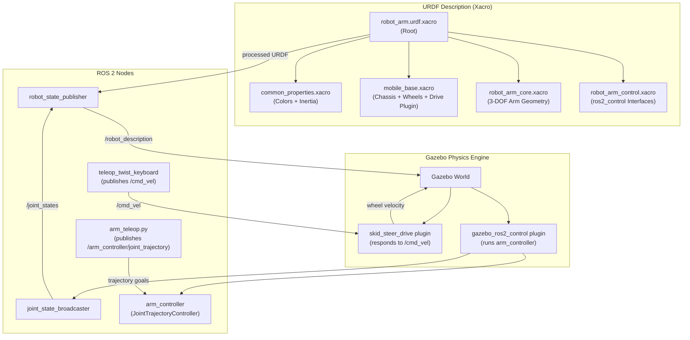

# Practical 3 — Attach Robot Arm to Base & Simulate in Gazebo 🤖🦾

## Objective
Combine the mobile robot base (Practical 1) and the 3-DOF arm (Practical 2) into a single **mobile manipulator**, load it into the **Gazebo physics simulator**, and control both the base (drive it around) and the arm (move joints) using keyboard teleoperation.

---

## 📦 Software Required

| Software | Purpose | Install |
|----------|---------|---------|
| ROS 2 Humble | Robot middleware | `sudo apt install ros-humble-desktop` |
| Gazebo (Classic) | Physics simulation | `sudo apt install ros-humble-gazebo-ros-pkgs` |
| `gazebo_ros2_control` | Bridge Gazebo ↔ ros2_control | `sudo apt install ros-humble-gazebo-ros2-control` |
| `ros2_control` + `ros2_controllers` | Hardware abstraction + trajectory control | `sudo apt install ros-humble-ros2-control ros-humble-ros2-controllers` |
| `teleop_twist_keyboard` | Drive the base via keyboard | `sudo apt install ros-humble-teleop-twist-keyboard` |

---

## 📁 Files in This Folder

```
Practical_3_Gazebo_Simulation/
├── urdf/
│   ├── robot_arm.urdf.xacro     ← Root file (entry-point — includes everything)
│   ├── common_properties.xacro  ← Colours + inertia macros
│   ├── mobile_base.xacro        ← 4-wheel base + Gazebo diff-drive plugin
│   ├── robot_arm_core.xacro     ← 3-DOF arm geometry (attaches to base)
│   └── robot_arm_control.xacro  ← ros2_control interfaces for Gazebo
├── launch/
│   └── gazebo.launch.py         ← Launches Gazebo + spawns robot + controllers
├── config/
│   └── ros2_controllers.yaml    ← Controller definitions (arm trajectory controller)
└── scripts/
    └── arm_teleop.py            ← Keyboard control for the 3 arm joints
```

### File-by-File Explanation

#### `urdf/robot_arm.urdf.xacro` — Root Entry-Point
The "glue" file. It uses `<xacro:include>` to pull all four xacro files together into one complete robot description. You normally never edit this file.

#### `urdf/common_properties.xacro` — Shared Definitions
Defines all colours and inertia formula macros so they are not duplicated. Edit here to add new colours.

#### `urdf/mobile_base.xacro` — The Robot's Body & Wheels
| Element | What it defines |
|---------|----------------|
| `base_link` | Rectangular chassis (orange box) |
| `wheel` macro | Reusable template instantiated 4× for each wheel |
| `lidar` link | Red LiDAR cylinder positioned forward on the chassis |
| Gazebo `skid_steer_drive` plugin | Makes the wheels respond to `cmd_vel` topic commands (keyboard driving) |

#### `urdf/robot_arm_core.xacro` — The Arm Geometry
Identical to Practical 2 but the `arm_base_joint` now attaches to `base_link` (the chassis) instead of `world`. This is the key change that "mounts" the arm on the mobile base.

```xml
<!-- arm_base_joint — this line connects the arm TO the base -->
<joint name="arm_base_joint" type="fixed">
    <parent link="base_link"/>    ← was "world" in Practical 2
    <child link="arm_base_link"/>
    <origin xyz="-0.1 0 0.2" rpy="0 0 0"/>  ← arm offset from chassis centre
</joint>
```

#### `urdf/robot_arm_control.xacro` — Hardware Interface for Gazebo
Tells `ros2_control` which joints are controllable and their position limits. Also loads the `gazebo_ros2_control` Gazebo plugin.

#### `launch/gazebo.launch.py` — Launch Orchestrator
| What it starts | Details |
|----------------|---------|
| Gazebo (empty world) | Physics engine |
| `robot_state_publisher` | Converts URDF → TF transforms |
| `spawn_entity.py` | Drops the robot into the Gazebo world |
| `joint_state_broadcaster` | Publishes current joint positions |
| `arm_controller` | Trajectory controller that moves the 3 arm joints |

#### `config/ros2_controllers.yaml` — Controller Configuration
```yaml
arm_controller:
  ros__parameters:
    joints: [joint_1, joint_2, joint_3]
    command_interfaces: [position]
    state_interfaces:  [position, velocity]
```
This configures the `joint_trajectory_controller` which accepts position goals for each arm joint.

#### `scripts/arm_teleop.py` — Arm Keyboard Controller

| Key | Action |
|-----|--------|
| `1` / `2` | joint_1 (Yaw) − / + |
| `3` / `4` | joint_2 (Pitch1) − / + |
| `5` / `6` | joint_3 (Pitch2) − / + |
| `q` | Quit |

Each keypress sends a `JointTrajectory` message to `/arm_controller/joint_trajectory` with a 0.5-second execution time.

---

## 🎨 Customisable Parameters

### 1. Arm Mounting Position on the Chassis (`robot_arm_core.xacro`)
```xml
<origin xyz="-0.1 0 0.2" rpy="0 0 0"/>
<!--           ↑    ↑  ↑
         X back  Y  Z height above chassis
    Try: "0 0 0.2"  → arm at centre of chassis
         "0.2 0 0.2" → arm at front  -->
```

### 2. Chassis Dimensions (`mobile_base.xacro`)
```xml
<box size="0.65 0.45 0.2"/>
<!--       Length Width Height — same as Practical 1 -->
```

### 3. Wheel Size & Separation (`mobile_base.xacro`)
```xml
<!-- Wheel geometry -->
<cylinder radius="0.08" length="0.04"/>

<!-- Wheel positions — controlled by macros x_reflect & y_reflect -->
<origin xyz="${x_reflect * 0.2} ${y_reflect * 0.245} 0" .../>
<!--                            ↑                ↑
                           0.2 = half wheelbase  0.245 = half track width  -->

<!-- Also update the Gazebo plugin to match: -->
<wheel_separation>0.49</wheel_separation>  <!-- 2 × 0.245 -->
<wheel_diameter>0.16</wheel_diameter>      <!-- 2 × 0.08  -->
```

### 4. Drive Torque & Speed (Skid-Steer Plugin in `mobile_base.xacro`)
```xml
<max_wheel_torque>20</max_wheel_torque>           <!-- Nm — increase for heavier robot -->
<max_wheel_acceleration>1.0</max_wheel_acceleration>  <!-- rad/s² -->
```

### 5. Arm Joint Step Size (`scripts/arm_teleop.py`)
```python
self.step_size = 0.1   # radians per keypress — try 0.05 for fine control
```

### 6. Controller Update Rate (`config/ros2_controllers.yaml`)
```yaml
update_rate: 50  # Hz — try 100 for smoother arm motion
```

### 7. Arm Link Dimensions (`robot_arm_core.xacro`)
See Practical 2 README — same parameters apply here.

---

## 🏃 How to Run

### Step 1 — Build the Package
```bash
cd ~/ros2_ws
# Copy (or symlink) the folder into src/ as robot_arm_description
cp -r ~/Basics-of-ROS-and--SLAM/Practical_3_Gazebo_Simulation ./src/robot_arm_description
```

### Step 3 — Build the Package
```bash
cd ~/ros2_ws
source /opt/ros/humble/setup.bash
colcon build --packages-select robot_arm_description
source install/setup.bash
```

### Step 4 — Launch Simulation & Controls

**Terminal 1 — Gazebo Simulation:**
```bash
ros2 launch robot_arm_description gazebo.launch.py
```

**Terminal 2 — Arm Teleoperation:**
```bash
python3 ~/Basics-of-ROS-and--SLAM/Practical_3_Gazebo_Simulation/scripts/arm_teleop.py
```

### Step 3 — Drive the Base (Keyboard)
```bash
# Terminal 2
export GAZEBO_MODEL_DATABASE_URI=""   # prevents online model download freeze
ros2 run teleop_twist_keyboard teleop_twist_keyboard
# Use W/A/S/D to drive the base
```

### Step 4 — Move the Arm (Keyboard)
```bash
# Terminal 3
python3 ~/Basics-of-ROS-and--SLAM/Practical_3_Gazebo_Simulation/scripts/arm_teleop.py
# Use 1–6 to move arm joints
```

---

## 🗺️ System Architecture Diagram



---

## ✅ Expected Output
- Gazebo opens with the orange mobile manipulator (4 wheels + 3-DOF arm).
- Driving via `teleop_twist_keyboard` physically moves the robot in the simulation.
- Running `arm_teleop.py` and pressing keys 1–6 visibly rotates each arm segment.
