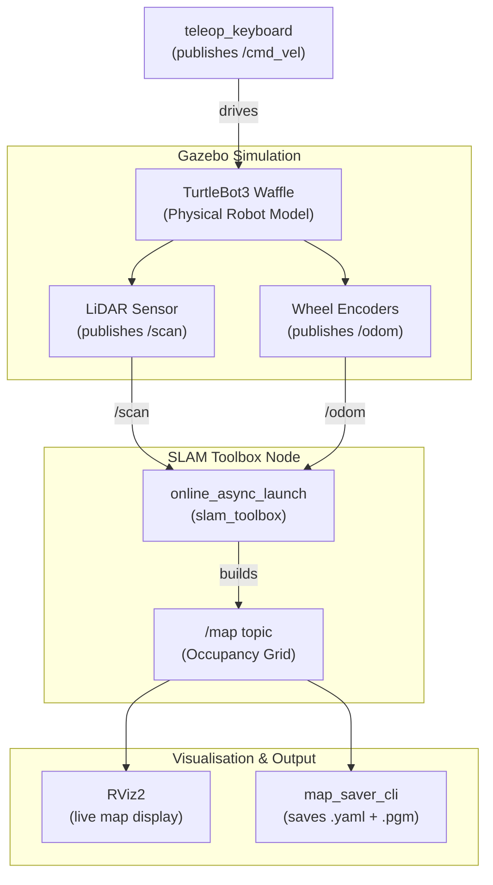

# Practical 4 — Implement SLAM Using ROS 2 🗺️

## Objective
Create a map of an **unknown environment** while simultaneously determining the robot's location — this is the core problem of **Simultaneous Localisation and Mapping (SLAM)**. We use the TurtleBot3 simulation and SLAM Toolbox to generate a 2D occupancy grid map by driving the robot through a virtual house.

---

## 📦 Software Required

| Software | Purpose | Install |
|----------|---------|---------|
| ROS 2 Humble | Robot middleware | `sudo apt install ros-humble-desktop` |
| SLAM Toolbox | Builds the 2D occupancy grid map from LiDAR + odom | `sudo apt install ros-humble-slam-toolbox` |
| TurtleBot3 | Simulated robot with LiDAR & odometry | `sudo apt install "ros-humble-turtlebot3*"` |
| Nav2 Map Server | Saves the finished map to `.yaml` + `.pgm` | `sudo apt install ros-humble-nav2-map-server` |
| RViz2 | Visualises the live map being built | Included in `ros-humble-desktop` |

---

## 📁 Files in This Folder

```
Practical_4_SLAM/
├── launch_slam.sh           ← ★ ONE-CLICK launcher (opens all 4 terminals in tmux)
├── save_map.sh              ← Saves the completed map as .yaml + .pgm
├── kill_slam.sh             ← Cleanly shuts down all SLAM processes
├── teleop_base.py           ← Custom keyboard driver with tunable speed
├── slam_params.yaml         ← Custom SLAM Toolbox parameters (resolution, range, etc.)
├── slam_rviz.rviz           ← Pre-configured RViz layout (Map + LiDAR + Robot)
└── Practical_4_Writeup.md   ← Original step-by-step writeup
```

### File-by-File Explanation

| File | What it does |
|------|-------------|
| `launch_slam.sh` | Creates a `tmux` session with 4 windows: Gazebo, SLAM Toolbox, RViz, and Teleop. Run this first. |
| `save_map.sh` | Calls `nav2_map_server map_saver_cli` to write `<name>.yaml` + `<name>.pgm` to `~/maps/`. Accepts an optional name argument. |
| `kill_slam.sh` | Kills the tmux session and all leftover `gzserver`/`gzclient` processes. Run this when done or if anything freezes. |
| `teleop_base.py` | A self-contained Python node that reads keypresses and publishes to `/cmd_vel`. More configurable than the default `turtlebot3_teleop`. |
| `slam_params.yaml` | Overrides default SLAM Toolbox settings. Every parameter is commented with what changing it does. Pass to `online_async_launch.py` via `slam_params_file:=`. |
| `slam_rviz.rviz` | Pre-built RViz config — opens with Map, RobotModel, and LaserScan displays already added. Loaded automatically by `launch_slam.sh`. |

---

## 🤖 Key Concepts

| Term | Meaning |
|------|---------|
| **Occupancy Grid** | A 2D map where each cell is either free (white), occupied (black/wall), or unknown (grey) |
| **LiDAR** | The TurtleBot3 LiDAR (`/scan` topic) provides 360° distance readings used to detect walls |
| **Odometry** | The `/odom` topic tracks how far and in which direction the robot has moved |
| **SLAM Toolbox** | Fuses LiDAR + Odometry to simultaneously build the map and localise the robot within it |
| `use_sim_time:=true` | Tells SLAM to use Gazebo's simulated clock instead of the real wall-clock time |

---

## 🎨 Customisable Parameters

### 1. TurtleBot3 Model — Change the Robot Shape
```bash
export TURTLEBOT3_MODEL=waffle        # default — rectangular, wide
# Alternatives:
export TURTLEBOT3_MODEL=burger        # smaller, circular footprint
export TURTLEBOT3_MODEL=waffle_pi     # same as waffle but with Raspberry Pi camera
```
> **Effect:** Changes the robot's physical dimensions, sensor layout, and visual appearance in Gazebo.

### 2. Takeoff Altitude / Simulation World — Use a Different Environment
```bash
# Replace turtlebot3_house with another world:
ros2 launch turtlebot3_gazebo turtlebot3_world.launch.py     # simple obstacle course
ros2 launch turtlebot3_gazebo turtlebot3_dqn_stage1.launch.py  # narrow corridor
```
> **Effect:** A different world shape = a different map. The house world produces a complex floor-plan map.

### 3. SLAM Toolbox Mode — Synchronous vs Asynchronous
```bash
# Asynchronous (default) — processes scans as they arrive, may skip some
ros2 launch slam_toolbox online_async_launch.py use_sim_time:=true

# Synchronous — processes every single scan, more accurate but slower
ros2 launch slam_toolbox online_sync_launch.py use_sim_time:=true
```
> **Effect:** Synchronous SLAM produces a higher-fidelity map but may lag behind the robot's movement.

### 4. Map Resolution — Increase Map Detail
The SLAM Toolbox default resolution is **0.05 m/cell** (5 cm per pixel). To change it, create a custom SLAM config:
```yaml
# my_slam_params.yaml
slam_toolbox:
  ros__parameters:
    resolution: 0.05        # metres per pixel — try 0.02 for finer detail
    max_laser_range: 12.0   # metres — TurtleBot3 LiDAR range
    minimum_travel_distance: 0.5   # move this far before adding a new scan
    minimum_travel_heading: 0.5    # or rotate this much (radians)
```
Then launch with:
```bash
ros2 launch slam_toolbox online_async_launch.py \
    use_sim_time:=true \
    slam_params_file:=/path/to/my_slam_params.yaml
```

### 5. Teleoperation Speed — Drive Faster or Slower
```bash
# The teleop node respects speed settings via keyboard:
# While running teleop_keyboard, press:
#   q/z — increase/decrease linear speed
#   w/x — increase/decrease angular speed
```
> **Note:** Driving too fast causes bad SLAM quality (motion blur for LiDAR). Slow, deliberate movement produces cleaner maps.

### 6. Map Save Name & Location
```bash
ros2 run nav2_map_server map_saver_cli -f ~/my_house_map
#                                          ↑ change this path and filename
# E.g.: -f ~/maps/lab_map  → saves lab_map.yaml + lab_map.pgm in ~/maps/
```

---

## 🏃 How to Run — Step by Step

### Step 1 — Clean Up (Prevent Gazebo Freeze)
```bash
# If Gazebo was previously running and became unresponsive:
killall -9 gzserver gzclient
export GAZEBO_MODEL_DATABASE_URI=""   # prevent online model downloads
```

### Step 2 — Launch TurtleBot3 in Gazebo (Terminal 1)
```bash
export TURTLEBOT3_MODEL=waffle
export GAZEBO_MODEL_DATABASE_URI=""
ros2 launch turtlebot3_gazebo turtlebot3_house.launch.py
```
Wait until Gazebo fully loads (you will see the house environment with the robot).

### Step 3 — Start SLAM Toolbox (Terminal 2)
```bash
ros2 launch slam_toolbox online_async_launch.py use_sim_time:=true
```
You will see: `[INFO] [slam_toolbox]: Message Filter dropping message: frame 'base_footprint'`
This is normal until the robot starts moving.

### Step 4 — Visualise in RViz (Terminal 3 — Optional but Recommended)
```bash
ros2 run rviz2 rviz2
```
In RViz:
1. Set **Fixed Frame** to `map`
2. Click **Add** → **By topic** → `/map` → **Map**
3. Also add **RobotModel** to see the TurtleBot3

### Step 5 — Drive the Robot (Terminal 4)
```bash
export TURTLEBOT3_MODEL=waffle
ros2 run turtlebot3_teleop teleop_keyboard
```

| Key | Action |
|-----|--------|
| `w` | Move forward |
| `a` | Turn left |
| `d` | Turn right |
| `s` | Move backward |
| `x` | Stop |

Drive through every room slowly. Watch the map grow in RViz.

### Step 6 — Save the Map (Terminal 5)
```bash
ros2 run nav2_map_server map_saver_cli -f ~/my_house_map
```
This outputs two files:
- `~/my_house_map.yaml` — metadata (resolution, origin, image path)
- `~/my_house_map.pgm` — the actual greyscale map image

---

## 🗺️ System Architecture Diagram



---

## ✅ Expected Output
1. Gazebo opens showing TurtleBot3 inside a house.
2. RViz shows a growing grey→white map as you explore rooms.
3. After exploring all rooms, run the map saver and get two files (`my_house_map.yaml` + `my_house_map.pgm`) representing the complete floor plan.

---

## 🔧 Troubleshooting

| Problem | Solution |
|---------|---------|
| Gazebo freezes / doesn't open | Run `killall -9 gzserver gzclient` then relaunch with `GAZEBO_MODEL_DATABASE_URI=""` |
| `spawn_entity` hangs forever | `gzserver` isn't ready; wait longer or kill and restart |
| Map doesn't update in RViz | Check Fixed Frame is set to `map`, not `odom` or `base_link` |
| Map has gaps / holes | Drive slower and revisit unexplored areas |
| `map_saver_cli` not found | `sudo apt install ros-humble-nav2-map-server` |
