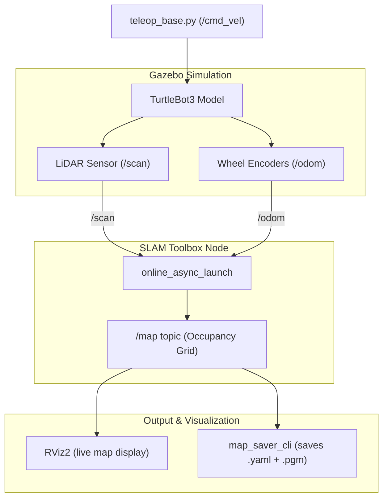

# Practical 4 — Implement SLAM Using ROS 2 🗺️

## Objective
Create a map of an **unknown environment** while simultaneously determining the robot's location — this is the core problem of **Simultaneous Localisation and Mapping (SLAM)**. We use TurtleBot3 simulation and SLAM Toolbox to generate a 2D occupancy grid map by driving through a virtual environment.

---

## 📦 Software Required

| Software | Purpose | Installation |
|----------|---------|--------------|
| ROS 2 Humble | Robot middleware | `sudo apt install ros-humble-desktop` |
| SLAM Toolbox | Builds 2D occupancy grid map from LiDAR + odometry | `sudo apt install ros-humble-slam-toolbox` |
| TurtleBot3 | Simulated robot with LiDAR & odometry | `sudo apt install "ros-humble-turtlebot3*"` |
| Nav2 Map Server | Saves map to `.yaml` + `.pgm` | `sudo apt install ros-humble-nav2-map-server` |
| RViz2 | Live map visualizer | Included in `ros-humble-desktop` |

---

## 📁 Files in This Folder

```
Practical_4_SLAM/
├── package.xml                  ← ROS 2 package declaration format 3
├── CMakeLists.txt               ← Ament CMake build configuration
├── slam_params.yaml             ← Custom SLAM Toolbox parameters (resolution, range, etc.)
├── slam_rviz.rviz               ← Pre-configured RViz visualizer layout
├── launch/
│   └── slam.launch.py           ← Portable ROS 2 Python launch file
├── launch_slam.sh               ← ★ One-click launcher (starts Gazebo, SLAM, RViz, Teleop)
├── save_map.sh                  ← Saves completed map to ~/maps/ as .yaml + .pgm
├── kill_slam.sh                 ← Clean SLAM pipeline shutdown script
├── teleop_base.py               ← Custom keyboard teleop driver (tunable speed)
└── Practical_4_Writeup.md       ← Original detailed practical writeup
```

---

## 🎨 Customisable Parameters

### 1. TurtleBot3 Model — Change Robot Model
```bash
export TURTLEBOT3_MODEL=waffle        # default — rectangular
export TURTLEBOT3_MODEL=burger        # smaller circular model
export TURTLEBOT3_MODEL=waffle_pi     # with camera mount
```

### 2. SLAM Resolution & Laser Range (`slam_params.yaml`)
```yaml
resolution: 0.05               # Map resolution (metres per pixel — try 0.02 for high detail)
max_laser_range: 12.0          # Max range of LiDAR sensor
minimum_travel_distance: 0.5   # Robot movement required before adding new scan
```

---

## 🏃 How to Run

### Method 1: One-Click Launcher (Recommended)
```bash
cd ~/Basics-of-ROS-and--SLAM/Practical_4_SLAM
chmod +x launch_slam.sh save_map.sh kill_slam.sh teleop_base.py
./launch_slam.sh
```

### Method 2: Direct Launch (No build required!)
```bash
cd ~/Basics-of-ROS-and--SLAM/Practical_4_SLAM
source /opt/ros/humble/setup.bash
export TURTLEBOT3_MODEL=waffle
ros2 launch launch/slam.launch.py
```

### Method 3: Building in a ROS 2 Workspace
```bash
# 1. Copy package into your ROS 2 workspace src directory
cd ~/ros2_ws/src
cp -r ~/Basics-of-ROS-and--SLAM/Practical_4_SLAM ./practical_4_slam

# 2. Build with colcon
cd ~/ros2_ws
source /opt/ros/humble/setup.bash
colcon build --packages-select practical_4_slam

# 3. Source overlay and launch
source install/setup.bash
export TURTLEBOT3_MODEL=waffle
ros2 launch practical_4_slam slam.launch.py
```

### Save Map & Cleanup
```bash
# Save map after driving around:
./save_map.sh my_house_map

# Shut down cleanly:
./kill_slam.sh
```

---

## 🗺️ System Architecture Diagram



---

## ✅ Expected Output
1. Gazebo opens rendering TurtleBot3 in house environment.
2. RViz2 visualizes real-time 2D occupancy map generation.
3. Map saver outputs `my_house_map.yaml` and `my_house_map.pgm`.
