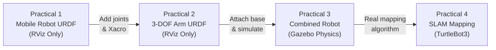

# Basics of ROS 2 and SLAM 🤖

A complete, beginner-to-intermediate journey through ROS 2 Humble robotics development — from building your first URDF robot model all the way to running a full SLAM mapping session.

> **All practicals run on Ubuntu 22.04 LTS + ROS 2 Humble.**

---

## 📂 Repository Structure

```
Basics-of-ROS-and-SLAM/
│
├── Practical_1_Mobile_Robot_URDF/      ← Single URDF file; visualise in RViz
│
├── Practical_2_Robot_Arm_URDF/         ← Xacro 3-DOF arm; visualise in RViz
│   ├── urdf/
│   ├── launch/
│   └── config/
│
├── Practical_3_Gazebo_Simulation/      ← Combined robot simulated in Gazebo
│   ├── urdf/
│   ├── launch/
│   ├── config/
│   └── scripts/
│
└── Practical_4_SLAM/                   ← SLAM with TurtleBot3
    └── README.md / Writeup
```

---

## 📖 Practical Overview

| # | Topic | Key Technology | Run Command |
|---|-------|---------------|-------------|
| 1 | Mobile Robot URDF | URDF + RViz2 | `ros2 launch urdf_tutorial display.launch.py model:=…` |
| 2 | 3-DOF Robot Arm | Xacro + RViz2 | `ros2 launch robot_arm_description display.launch.py` |
| 3 | Gazebo Simulation | Gazebo + ros2_control | `ros2 launch robot_arm_description gazebo.launch.py` |
| 4 | SLAM | SLAM Toolbox + TurtleBot3 | `ros2 launch turtlebot3_gazebo turtlebot3_house.launch.py` |

---

## ⚙️ One-Time System Setup

```bash
# 1. ROS 2 Humble (if not already installed)
sudo apt update && sudo apt install ros-humble-desktop

# 2. Tools used across practicals
sudo apt install ros-humble-xacro \
                 ros-humble-joint-state-publisher-gui \
                 ros-humble-gazebo-ros-pkgs \
                 ros-humble-gazebo-ros2-control \
                 ros-humble-ros2-control \
                 ros-humble-ros2-controllers \
                 ros-humble-slam-toolbox \
                 "ros-humble-turtlebot3*" \
                 ros-humble-nav2-map-server

# 3. Source ROS (add to ~/.bashrc for convenience)
echo "source /opt/ros/humble/setup.bash" >> ~/.bashrc
source ~/.bashrc
```

---

## 🚀 Quick-Start: Each Practical

Click the folder links above or jump directly to each practical's own `README.md` for step-by-step instructions, parameter tables, and architecture diagrams.

---

## 🎓 Learning Progression



---

*Made with ❤️ using ROS 2 Humble on Ubuntu 22.04*
